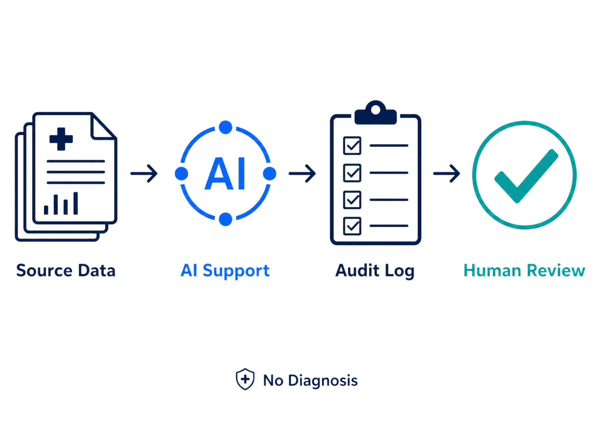

# LinqEdge

LinqEdge is a healthcare AI companion designed to help patients and care teams turn real-time wearable, medical device, and edge compute data into simple, actionable insights.

The platform connects with third-party health data sources such as Apple Watch, Fitbit, WHOOP, Oura Ring, and other wearable devices, while also supporting Medtronic-style edge compute devices that process patient signals closer to the source. LinqEdge also uses generative AI to summarize patient trends, explain health insights in simple language, and help clinicians quickly understand what changed.

## Problem

Patients generate valuable health data every day through wearable devices and connected medical technology, but that information is often scattered across different apps, devices, and systems.

LinqEdge helps bring that data together and uses AI to turn raw health signals into clear insights for patients and care teams.

## What the Patient Sees

Patients can view:

- Daily health summaries
- Heart rate, sleep, activity, and recovery trends
- Simple GenAI-powered wellness explanations
- Alerts when unusual patterns are detected
- Clear recommendations for when to monitor symptoms or contact a care team

## Core Features

- Wearable health data integration
- Edge compute support for connected medical devices
- Generative AI health summaries
- AI-powered trend analysis
- Patient-friendly health dashboard
- Risk detection and alerting
- Clinician-ready summaries
- Privacy-focused data handling

## Data Sources

LinqEdge is designed to support data from:

- Apple Watch
- Fitbit
- WHOOP
- Oura Ring
- Medtronic-style edge compute devices
- Other remote patient monitoring devices

## Project Flow

## Project Structure

- `LinqCompanionRN/` — mobile companion application
- `backend/` — backend services and API logic
- `spec.md` — project planning and system specification
- `simple_healthcare_ai_flow.png` — system flow diagram

## Generative AI Layer

LinqEdge uses generative AI to make health data easier to understand. Instead of showing patients and clinicians only raw numbers, the AI layer can summarize trends, explain changes, and generate simple next-step guidance.

Examples include:

- “Your resting heart rate has been higher than normal for the past 3 days.”
- “Your sleep recovery has dropped compared to your weekly average.”
- “Consider monitoring symptoms and contacting your care team if this continues.”

## Compliance Focus

Because LinqEdge uses healthcare-related data, the system is designed around privacy and compliance principles:

- Patient consent before connecting third-party data
- Secure handling of health information
- Data minimization by only collecting necessary data
- Clear separation between patient-facing insights and clinician review
- Audit-friendly design for future healthcare integrations

## Future Improvements

- Add real API connections for wearable platforms
- Build a clinician dashboard
- Add secure authentication
- Improve risk scoring and alert accuracy
- Expand edge compute device support
- Expand compliance documentation
